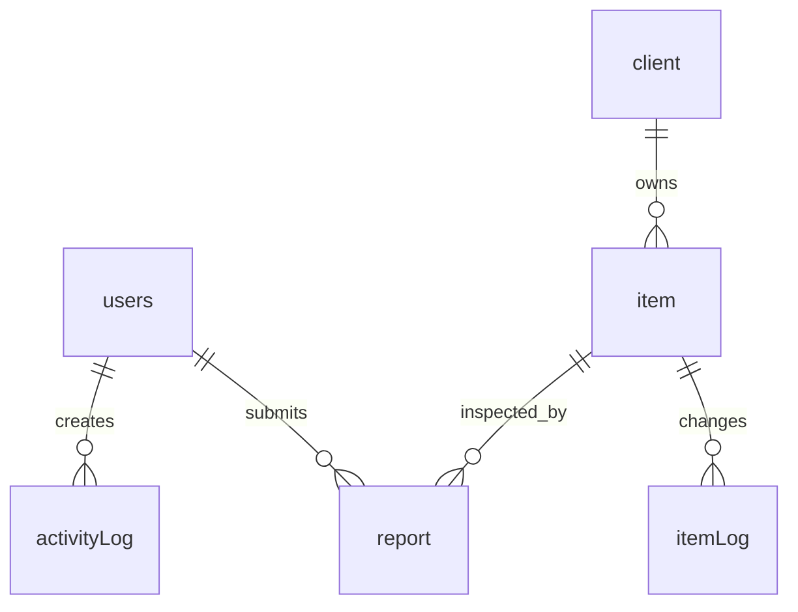

# Database Schema - Fire Extinguisher Management System

Database engine: MongoDB via Mongoose.

The backend connects with `MONGODB_URI` and defines these collections in `Backend/api/DB`.

## Collections

### `users`

Defined schema in `Backend/api/DB/users.js`.

| Field | Type | Required | Notes |
| --- | --- | --- | --- |
| `_id` | ObjectId | Yes | MongoDB generated ID |
| `username` | String | Yes | Unique login username |
| `password` | String | Yes | Hashed password |
| `display_name` | String | No | Display name shown in the UI |
| `role` | String | Yes | One of `Member`, `Super Member`, `Worker`, `Admin`, `Super Admin` |
| `client` | String | No | Primary client/company access |
| `client_access` | String[] | No | Additional client IDs/names allowed for the user |
| `lastLogin` | Date | No | Last successful login timestamp |
| `isActive` | String | No | Defaults to `True` |
| `createdAt` | Date | Auto | Mongoose timestamp |
| `updatedAt` | Date | Auto | Mongoose timestamp |

### `client`

Flexible collection (`strict: false`) used for company and branch data.

| Field | Type | Notes |
| --- | --- | --- |
| `company` | String | Company/client name |
| `branch` | String | Branch name |
| `address` | String | Branch/company address when present |
| `location` | Object/String | Location or map coordinates when present |
| `lastCheck` | Date/String | Last inspection date |
| `nextCheck` | Date/String | Next inspection date |
| other fields | Any | Stored as flexible MongoDB document data |

### `item`

Flexible collection (`strict: false`) used for fire extinguisher inventory.

| Field | Type | Notes |
| --- | --- | --- |
| `id` / `_id` | String/ObjectId | Item identifier |
| `company` | String | Owning company/client |
| `branch` | String | Branch/location |
| `type` | String | Extinguisher type |
| `status` | String | Current item status |
| `serialNumber` | String | Serial or asset number when present |
| `location` | String | Physical location |
| `lastCheck` | Date/String | Last inspection date |
| `nextCheck` | Date/String | Next inspection date |
| other fields | Any | Stored as flexible MongoDB document data |

### `report`

Flexible collection (`strict: false`) used for inspection reports.

| Field | Type | Notes |
| --- | --- | --- |
| `itemId` | String/ObjectId | Related item |
| `company` | String | Related company |
| `branch` | String | Related branch |
| `user` | String | Worker/user who submitted report |
| `status` | String | Report workflow status |
| `image` | String | Uploaded image filename/path |
| `createdAt` | Date/String | Report creation date |
| `updatedAt` | Date/String | Last update date |
| other fields | Any | Stored as flexible MongoDB document data |

### `itemLog`

Flexible collection (`strict: false`) for item status/history records.

| Field | Type | Notes |
| --- | --- | --- |
| `itemId` | String/ObjectId | Related item |
| `action` | String | Change/action performed |
| `user` | String | Actor |
| `createdAt` | Date/String | Log timestamp |
| other fields | Any | Stored as flexible MongoDB document data |

### `activityLog`

Flexible collection (`strict: false`) for login/logout and system activity.

| Field | Type | Notes |
| --- | --- | --- |
| `username` | String | Actor username |
| `role` | String | Actor role |
| `client_id` | String | Client scope when present |
| `activity` | String | Activity description |
| `createdAt` | Date/String | Log timestamp |
| other fields | Any | Stored as flexible MongoDB document data |

## Relationships

MongoDB references are stored mostly as plain fields rather than enforced foreign keys.

## Setup

1. Create a MongoDB database.
2. Set `MONGODB_URI` in `Backend/.env`.
3. Start the backend. Collections are created automatically when documents are inserted.
