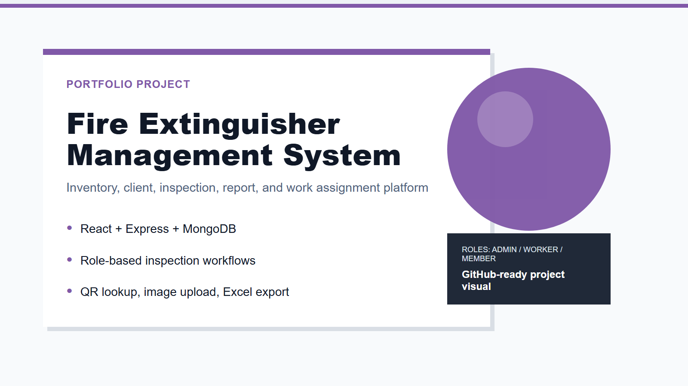
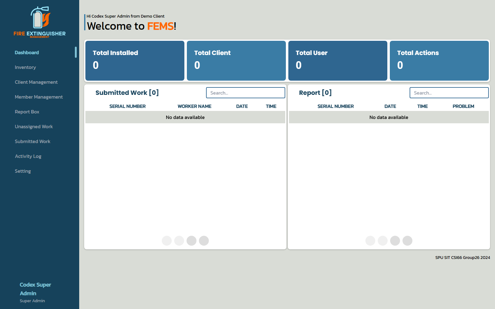
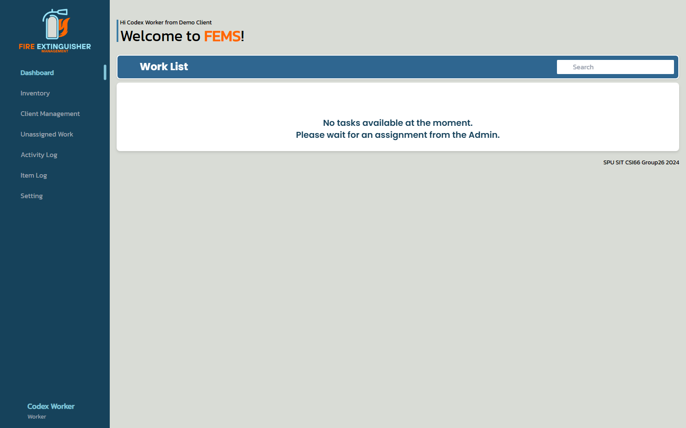
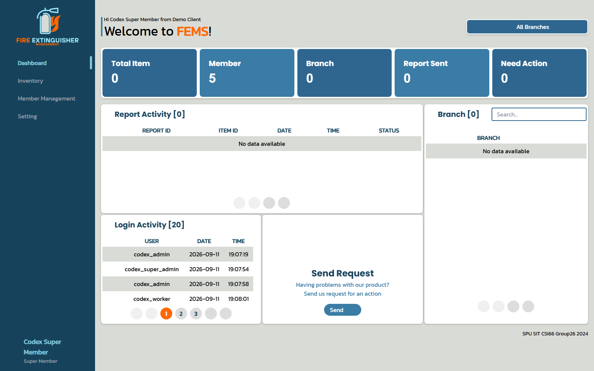
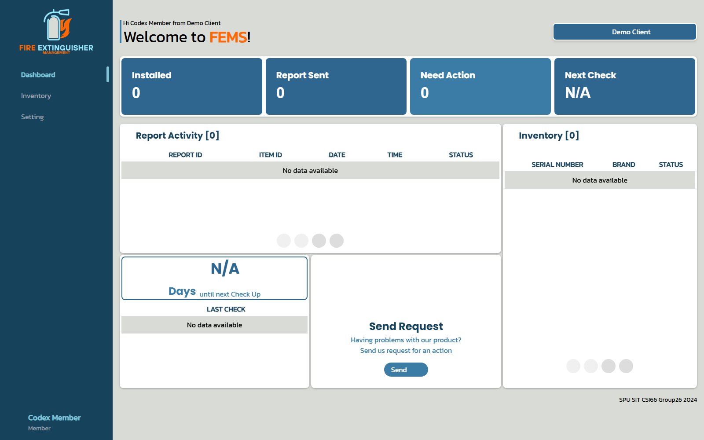
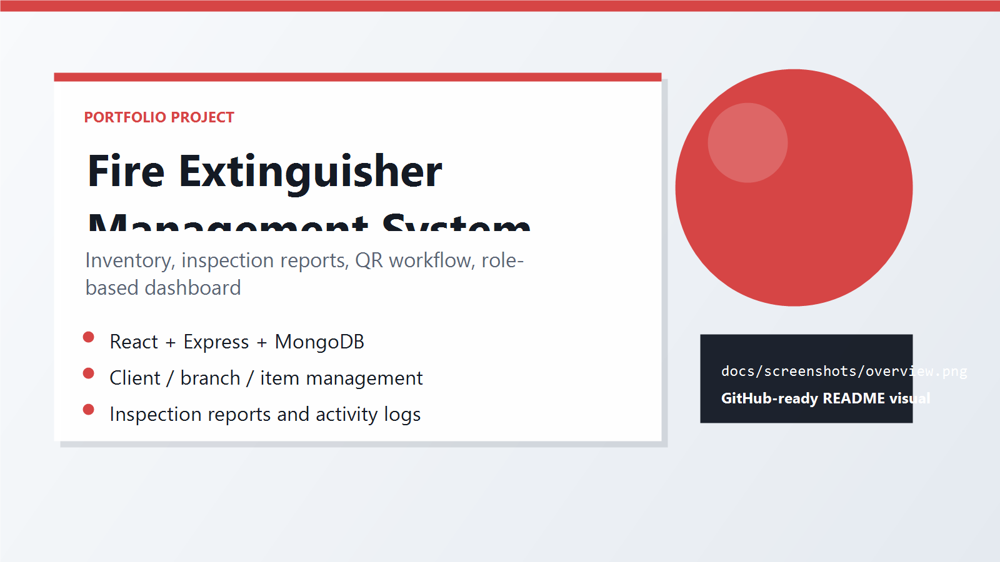

# Fire Extinguisher Management System

A full-stack web application for managing fire extinguisher inventory, client locations, inspections, reports, user roles, and activity logs. The frontend is a React/Vite dashboard and the backend is an Express API backed by MongoDB.

## Screenshots



> Role images are captured from the running frontend with the local MongoDB backend connected. Demo Client may show empty counts until extinguisher records are added.

### Role-based UI

| Role | Preview |
| --- | --- |
| Super Admin |  |
| Admin |  |
| Worker |  |
| Super Member |  |
| Member |  |

<p align="center">
  
</p>

## Features

- Role-based login and protected pages for Member, Super Member, Worker, Admin, and Super Admin users.
- Fire extinguisher inventory by client company and branch.
- QR code support for item lookup and inspection workflows.
- Inspection report creation with image upload and report status tracking.
- Client, branch, member, worker, and operator management.
- Dashboard views, activity logs, submitted work, unassigned work, and Excel export.
- Swagger documentation exposed by the backend.

## Tech Stack

| Layer | Technology |
| --- | --- |
| Frontend | React 18, Vite, React Router, MUI, Tailwind CSS, Chart.js, Axios |
| Backend | Node.js, Express, Mongoose, JWT, Multer, Swagger UI |
| Database | MongoDB |
| File storage | Local `Backend/img` folder for uploaded report images |

## Project Structure

```text
CSI-Final-main/
  Backend/
    app.js
    api/
      DB/              # Mongoose models and MongoDB connection
      *API.js          # Express route handlers
    img/               # Uploaded report images
    middleware/
  FrontEnd/
    src/
      Auth/
      Component/
      Layout/
      Pages/
```

## Prerequisites

- Node.js 18+
- npm
- MongoDB database or MongoDB Atlas cluster

## Environment Variables

Create `Backend/.env` from `Backend/.env.example`:

```env
MONGODB_URI=mongodb://localhost:27017/fems
JWT_SECRET=change_me
JWT_EXPIRES_IN=4h
JWT_ADMIN_EXPIRES_IN=8h
JWT_WORKER_EXPIRES_IN=24h
PORT=3000
```

Create `FrontEnd/.env` from `FrontEnd/.env.example` if Google Maps Places is used:

```env
VITE_GOOGLE_MAPS_API_KEY=change_me
```

Do not commit real credentials. The old `Backend/env` file contains local configuration and should stay out of Git.

## Run Locally

```bash
cd Backend
npm install
node app.js
```

```bash
cd FrontEnd
npm install
npm run dev
```

Default local URLs:

- Frontend: `http://localhost:5173`
- Backend API: `http://localhost:3000`
- Swagger UI: `http://localhost:3000/api-docs`

## Database

The database is documented in `DATABASE_SCHEMA.md`. Most collections use flexible MongoDB documents (`strict: false`), while `users` has a defined Mongoose schema.

## GitHub Notes

Before publishing, make sure these are not committed: `node_modules/`, `.env`, `env`, credential files, and uploaded/private images in `Backend/img/`.
